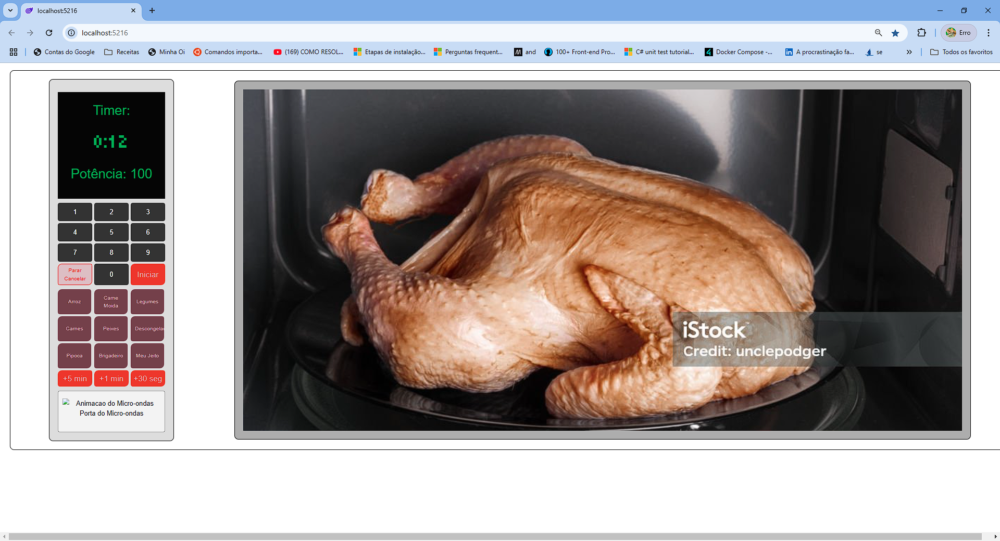

# MicroWaveBlazor

Este repositório contém um projeto Blazor que simula a interface de um micro-ondas.

## Visão Geral

O MicroWaveBlazor é um projeto desenvolvido para demonstrar como criar uma interface de usuário interativa utilizando Blazor. O projeto inclui funcionalidades básicas de um micro-ondas, como definir tempo de cozimento e potência.

## Funcionalidades

- Definição de tempo de cozimento
- Ajuste de potência
- Interface de usuário interativa
- Exibição de imagem representando o alimento sendo cozinhado

## Imagem do App

Aqui está uma captura de tela da interface do MicroWaveBlazor:



## Como Usar

1. Clone o repositório:
    ```bash
    git clone https://github.com/luizpkey/MicroWaveBlazor.git
    ```

2. Navegue até o diretório do projeto:
    ```bash
    cd MicroWaveBlazor
    ```

3. Abra o projeto no Visual Studio e compile.

4. Execute o projeto e acesse a interface no navegador.

## Contribuições

Contribuições são bem-vindas! Sinta-se à vontade para abrir issues e enviar pull requests.

## Licença

Este projeto está licenciado sob a [MIT License](LICENSE).

## Contato

Se você tiver alguma dúvida ou sugestão, sinta-se à vontade para entrar em contato.

---

Espero que isso ajude! Se precisar de mais alguma coisa ou de ajustes, estarei por aqui para ajudar! 😊
